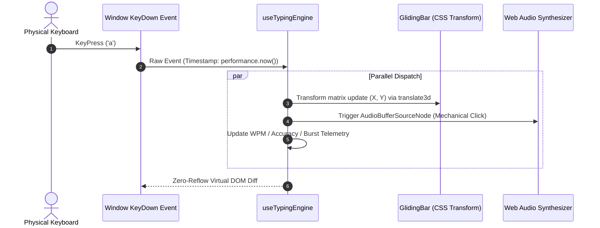
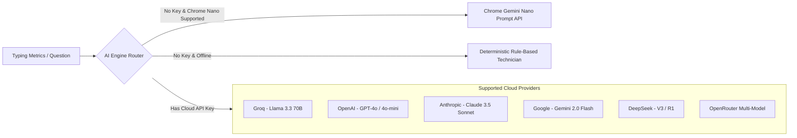
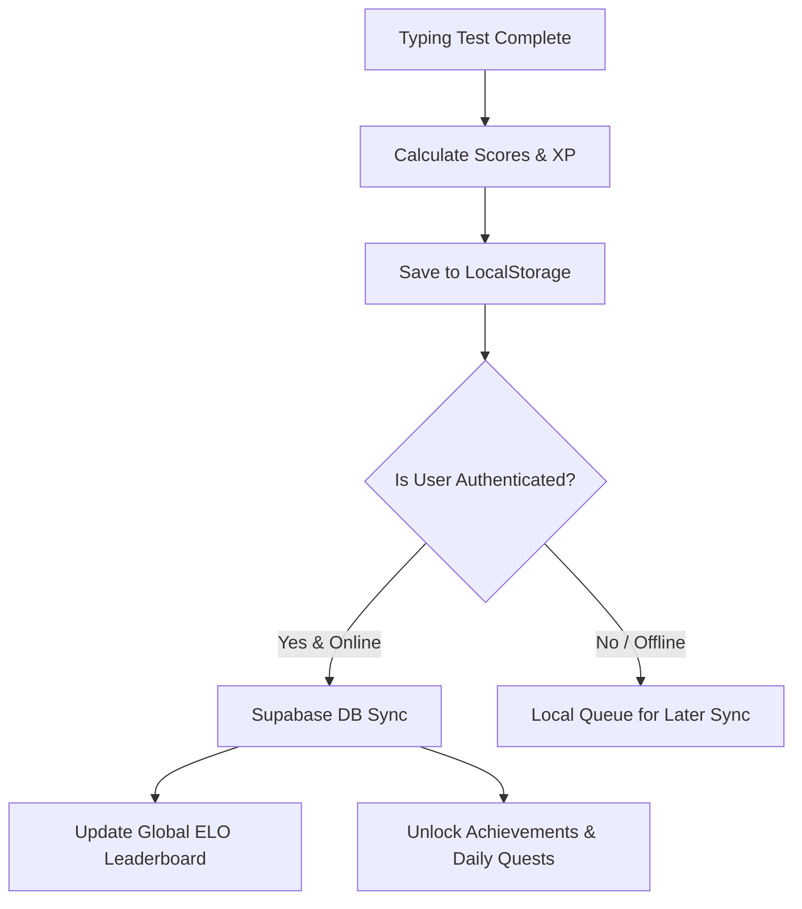

# TypeNova: System Architecture & Technical Specifications

**Version:** 2.5.0  
**Target Systems:** Modern Evergreen Browsers, PWA Standalone (Desktop & Mobile)  
**Primary Language:** TypeScript / React 19 / Vite

---

## 1. Architectural Philosophy

TypeNova is engineered around three non-negotiable principles:
1. **Sub-Millisecond Input Latency:** Zero forced synchronous layout reflows on typing keystrokes.
2. **120+ FPS Visual Immersion:** Strict memoization boundaries, GPU shader resource recycling, and pausable render loops.
3. **Offline-First Resilience with BYOK Privacy:** Complete core functionality without internet access, with sensitive user API keys kept strictly on the client.

```mermaid
flowchart TB
    subgraph UI_Layer [Presentation & Interaction Layer]
        MainApp[App.tsx Orchestrator]
        TypingView[TypingArea.tsx & GlidingBar]
        CyberHands[CyberHands.tsx 3D SVG Overlay]
        AruChat[AIChatBot.tsx & LaserFlow Shader]
        MultiplayerHUD[RaceModal.tsx & ReplayScrubber]
        VideoOverlay[VideoCallOverlay.tsx WebRTC PiP]
    end

    subgraph State_Engine [Core State & Logic Engines]
        useTypingEngine[useTypingEngine Hook]
        useRPGSystem[useRPGSystem Hook]
        useSmartEngine[useSmartEngineConfig & aiClient]
        useRace[useRace & WebSocket Syncer]
        useWebRTC[useWebRTC P2P Signaler]
        useAudioEngine[Web Audio Synthesizer]
    end

    subgraph Persistence_Cloud [Data & Cloud Integration]
        LocalStorage[Client LocalStorage Engine]
        WorkboxSW[Workbox Service Worker Precache]
        SupabaseAuth[Supabase Auth & RLS Postgres]
        SocketIO[Realtime WebSocket Relay]
        LLMProviders[Cloud LLMs & Chrome Gemini Nano]
    end

    MainApp --> useTypingEngine
    MainApp --> useRPGSystem
    MainApp --> useSmartEngine
    MainApp --> useRace
    MainApp --> useWebRTC
    MainApp --> useAudioEngine

    useTypingEngine --> TypingView
    useRPGSystem --> CyberHands
    useSmartEngine --> AruChat
    useRace --> MultiplayerHUD
    useWebRTC --> VideoOverlay

    useTypingEngine --> LocalStorage
    useRPGSystem --> SupabaseAuth
    useRace --> SocketIO
    useSmartEngine --> LLMProviders
    WorkboxSW --> UI_Layer
```



---

## 2. Low-Latency Typing Pipeline

### 2.1 Reflow-Free Caret Projection
Standard typing applications often calculate the caret's bounding box using `element.getBoundingClientRect()` or deep `offsetParent` loops on every keystroke. In TypeNova, this is eliminated:
* **Pre-computed Character Metrics:** Line wrapping and character offset positions are precalculated during test initialization.
* **Hardware-Accelerated Caret Translation:** The `GlidingBar` uses pure CSS `transform: translate3d(x, y, 0)` with hardware compositing (`will-change: transform`), completely bypassing the browser's layout recalculation phase.
* **Result:** Processing time per keypress is $< 1.5\text{ms}$.



---

## 3. Visual & WebGL Lifecycle Management

### 3.1 Three.js Kinetic Mechanical Keyboard
* **Structure:** A fully modeled 100% mechanical keyboard rendered in Three.js on landing screens.
* **Emissive Reactive Lighting:** An in-memory `Map<string, KeyData[]>` maps physical `event.code` keys to 3D meshes. When a user presses a key, the mesh Y-axis depresses by `0.5` units and its material `emissiveIntensity` spikes to `3.0` (pure white bloom) before smoothly interpolating back via exponential decay.
* **Edge Masking:** Uses CSS `maskImage: linear-gradient` to blend canvas boundaries into the `#080809` background without clipping.

### 3.2 SplashCursor (GPU Fluid Simulation)
* **Double-Buffered FBOs:** Computes fluid velocity, pressure, and vorticity using floating-point framebuffer textures in custom GLSL fragment shaders.
* **Lifecycle Cleanup:** On component unmount, all WebGL buffers, textures, framebuffers, shaders, and programs are explicitly disposed via `gl.deleteTexture`, `gl.deleteProgram`, and `gl.getExtension('WEBGL_lose_context')?.loseContext()`, preventing VRAM leaks across route changes.

### 3.3 LaserFlow (Volumetric Laser Shader in AIChatBot)
* **Pausable Render Loop:** When the AI Coach drawer is closed, `<LaserFlow paused={!isOpen} />` skips `renderer.render()`, freeing 100% of GPU compute during active typing gameplay.

---

## 4. AI Coach Architecture & BYOK Engine

TypeNova implements a **hybrid dual-layer AI routing engine**:



### 4.1 On-Device Gemini Nano Integration
* Detects Chrome's native AI API via `window.ai.languageModel`.
* When available, all weakness analysis, encouragement, and drill generation run **100% offline on the user's NPU/GPU** with zero network latency.

### 4.2 Security & Key Isolation
* API keys are stored in browser `localStorage` under `typenova_byok_api_key`.
* Keys are never proxied through TypeNova backend servers; requests are dispatched directly from the client browser to provider endpoints (`api.groq.com`, `api.openai.com`, etc.) via HTTPS CORS.

---

## 5. Real-Time Multiplayer Protocol

Multiplayer races utilize an event-driven WebSocket architecture:

### 5.1 Protocol Sequence
1. **Lobby Join:** Client dispatches `join_room` with `roomId`, `playerId`, `username`, and equipped `handSkin`.
2. **Race Countdown:** Server syncs a high-precision UTC start timestamp (`start_timestamp`).
3. **Throttled Telemetry:** During the race, clients emit `player_progress` throttled to **20Hz (50ms intervals)**:
   ```json
   {
     "roomId": "CYBER-99",
     "playerId": "usr_8f12a",
     "progress": 0.68,
     "currentWpm": 134.2,
     "errors": 1
   }
   ```
4. **Race Completion:** The server validates character counts, logs the match to Supabase PostgreSQL, and broadcasts the final podium placements.

---

## 6. WebRTC Peer Comms Architecture

To enable video calling during races with zero media server hosting costs:
* **Signaling Channel:** Uses lightweight WebSocket messages (`signal_offer`, `signal_answer`, `signal_ice_candidate`).
* **Media Streams:** Direct peer-to-peer WebRTC `RTCPeerConnection` with STUN servers (`stun:stun.l.google.com:19302`).
* **Floating Window:** Renders in a hardware-accelerated picture-in-picture draggable portal with smooth pointer tracking.

---

## 7. Persistence & Cloud Synchronization



* **Offline-First:** All scores, daily quests, and local settings are instantly written to `localStorage`.
* **Sync Engine (`useCloudSync`):** On authentication or reconnection, queued offline results are batch-synced to Supabase via Postgres transactions with optimistic conflict resolution.

---

*TypeNova Architecture — Engineered for precision, speed, and scale.*
