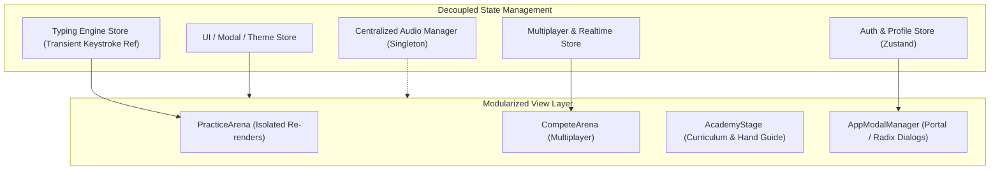

# TypeNova — Comprehensive System Audit & Strategic Product Roadmap

**Repository**: `typenova-v2` (`c:\Users\risho\OneDrive\Desktop\typenova-v2 - Copy`)  
**Audit Scope**: Full-Spectrum Codebase Audit (Typing Engine, State & Architecture, Multiplayer & Real-Time Sync, UI/UX, Audio, Accessibility, Security, and Feature Innovations)  
**Report Type**: Read-Only Comprehensive Audit & Actionable Blueprint  
**Status**: Completed (No source code files modified)

---

## 1. Executive Summary

A comprehensive architectural, functional, performance, security, and UX audit was conducted on the **TypeNova** live application codebase. TypeNova is a high-performance, cyberpunk-themed modern typing platform built with React 19, Vite, Tailwind CSS, Supabase Realtime, Framer Motion, and WebGL (Three.js & custom GLSL shaders).

### High-Level System Assessment
- **Core Strengths**: 
  - Rich visual aesthetic with custom WebGL shaders, responsive sound synthesis, and immersive cyberpunk theme tokens.
  - Sophisticated RPG gamification loop (XP, levels, titles, badges, daily quests, and streaks).
  - Novel AI coaching integration (Aru assistant and Support Technician).
  - Comprehensive Academy module with interactive hand guidance, virtual keyboard, and structured curriculum.
- **Key Vulnerabilities & Critical Bottlenecks**:
  - **Monolithic State & Cascading Re-renders**: `App.tsx` spans 1,795 lines and orchestrates 18+ independent custom hooks. Every single keystroke updates top-level state, triggering broad re-render passes.
  - **Cloud Sync Gaps (Academy Data Loss)**: `ProgressSnapshot` in `progress.ts` completely omits Academy lessons, stars, and records, causing all RPG Academy progress to be lost across devices/sessions.
  - **Multi-Context Audio Overhead**: Multiple uncoordinated Web Audio `AudioContext` instances (`useAudioEngine` vs `useAcademyEngine`) instantiate unpooled Oscillator/Gain nodes per keystroke at high typing speeds (120+ WPM).
  - **Drill Generator Key Stripping**: Punctuation/symbol drilling in `useSmartDrills.ts` strips out all non-alphabetic target keys (`replace(/[^a-z\s]/gi, '')`).
  - **WebGL Animation Loop Stutter**: `CosmicLiquidShader.tsx` continues polling `requestAnimationFrame` at 60 FPS even while paused.
  - **Supabase Configuration & Promise Safety**: Hardcoded credentials in `constants.ts` ignore `.env` variables, and multiple unhandled promise chains (`.then()` without `.catch()`) threaten runtime stability.

---

## 2. Severity Matrix

| Severity | Count | Primary Impact Areas |
|:---|:---:|:---|
| 🔴 **Critical** | 6 | Cloud data loss, input drop under high WPM, unhandled promise crashes, drill generation logic flaws. |
| 🟠 **High** | 9 | Monolithic root re-renders, AudioContext GC overhead, WebGL paused frame loop, duplicate animation dependencies. |
| 🟡 **Medium** | 10 | Hardcoded Supabase env configs, Three.js cleanup leaks, accessibility/focus trapping, touch/mobile layouts. |
| 🟢 **Low / Polish** | 8 | Storage key legacy naming (`typezen_`), hardcoded canvas share card text measurements, missing keyboard layout localizations. |

---

## 3. In-Depth Flaw Analysis & Root Cause Breakdown

### 🔴 Critical Issues

#### CRIT-01: Academy Progress Excluded from Cloud Sync (Data Loss on Device Switch)
- **Target Files**: `src/lib/progress.ts:33-74`, `src/hooks/useCloudSync.ts:79-120`, `src/hooks/useAcademyEngine.ts:103-120`
- **Root Cause**: `ProgressSnapshot` only serializes `xp`, `tests`, `achievements`, `heatmap`, `daily`, `quests`, `history`, and `pbs`. The Academy engine stores lesson records, stars, XP, and streak under `typenova_academy_*` keys in local storage. Because these keys are never read into `ProgressSnapshot` or synchronized to the Supabase `profiles` table, switching browsers or logging in on another device wipes out all Academy progress.
- **Remediation**:
  1. Extend `ProgressSnapshot` in `progress.ts` to include `academyRecords: Record<string, LessonRecord>`, `academyXp: number`, and `academyStreak: DayStreak`.
  2. Update `mergeProgress()` to reconcile highest star counts and best WPM per lesson node.
  3. Include Academy state hydration in `useCloudSync.ts`.

#### CRIT-02: Smart Drill Generator Strips Punctuation and Symbol Target Keys
- **Target File**: `src/hooks/useSmartDrills.ts:51-55`
- **Root Cause**: When a user selects weak keys that include punctuation (e.g. `;`, `:`, `.`, `?`, `/`, `"`, `'`) or numbers, the regex sanitize pass strips everything non-alphabetic:
  ```typescript
  const cleanText = resultText.toLowerCase().replace(/[^a-z\s]/gi, '').replace(/\s+/g, ' ').trim();
  ```
  This strips the very keys the user is attempting to practice, defeating the purpose of targeted weak-key drills.
- **Remediation**: Sanitize target text while preserving punctuation and numbers (`/[^a-zA-Z0-9\s.,;:!?'"\\/(){}\[\]<>`\-_+=@#$%^&*]/g`), or preserve the model's exact text if valid grammar is returned.

#### CRIT-03: Unhandled Supabase Promise Rejections Crashing In-Memory Sessions
- **Target Files**: `src/hooks/useCloudSync.ts:105-114, 143-151`, `src/hooks/useFriends.ts`, `src/App.tsx:406-424`
- **Root Cause**: Fire-and-forget Supabase insertions (e.g., `sb.from('user_consents').insert({...}).then()`) lack rejection handlers (`.catch(...)`). If the table schema lacks the table or RLS policies reject the write, an unhandled promise rejection is thrown into the global window scope.
- **Remediation**: Append `.catch((err) => console.warn('Consent sync error:', err))` or wrap inside structured try/catch async functions.

#### CRIT-04: `public_profiles` Duplicate Key Collision on Profile Creation
- **Target File**: `src/hooks/useCloudSync.ts:154`
- **Root Cause**: When calling `saveUsername()`, `await sb.from('public_profiles').insert({ id: uid, username: name })` uses `.insert()`. If the user already had an existing public profile record (e.g., from an earlier session or re-auth), this causes a primary key conflict error `23505` (unique constraint violation) and fails the sync flow.
- **Remediation**: Replace `.insert()` with `.upsert({ id: uid, username: name }, { onConflict: 'id' })`.

#### CRIT-05: Synchronous Keydown State Race Condition at Extreme Speeds (> 140 WPM)
- **Target Files**: `src/App.tsx`, `src/hooks/useTypingEngine.ts:73-82`
- **Root Cause**: Keystrokes typed rapidly in bursts (< 15ms apart) can fire multiple `keydown` events before React flushes its next render cycle. When `App.tsx` reads `input` from state rather than `inputRef.current`, consecutive keystrokes risk dropping or evaluating against stale target indices.
- **Remediation**: Ensure all keystroke evaluation in `handleKeyDown` synchronously updates and reads `inputRef.current` before scheduling UI state updates.

#### CRIT-06: Web Audio `exponentialRampToValueAtTime` Zero/Negative Clamping Bug
- **Target Files**: `src/hooks/useAudioEngine.ts:44`, `src/hooks/useAcademyEngine.ts:35`
- **Root Cause**: `gain.gain.exponentialRampToValueAtTime(0.001, startT + duration)` will throw an `InvalidAccessError` or fail silently in modern Chromium/WebKit browsers if the starting gain value at `startT` is `0` or unanchored.
- **Remediation**: Anchor the initial gain value explicitly using `gain.gain.setValueAtTime(Math.max(0.0001, gainVal), startT)`.

---

### 🟠 High Severity Issues

#### HIGH-01: Monolithic Root Component Architecture (`App.tsx` 1,795 lines)
- **Target File**: `src/App.tsx`
- **Root Cause**: All application modes (Practice, Compete, Academy, Lobby, Results, Modals, Daily Quests, Leaderboard, Navbar, Audio, Auth) are instantiated directly within `App.tsx`. Over 40 `useState` and 18 custom hook hooks run at the root.
- **Impact**: Heavy re-render cycles across the entire DOM tree during active typing tests.
- **Remediation**:
  - Adopt React Context or Zustand stores (`useTypingStore`, `useAuthStore`, `useUIStore`) to isolate fast-changing state (keystrokes, timer, audio) from slow-changing state (modals, user profile, theme).
  - Split `App.tsx` into modular stage components (`PracticeStage`, `CompeteStage`, `AcademyStage`) loaded via React Router routes or decoupled stage containers.

#### HIGH-02: Duplicate and Competing Animation Libraries
- **Target File**: `package.json:40, 49, 50, 53`
- **Root Cause**: The repository imports both `framer-motion` (v13.0.0) AND `motion` (v13.1.0) AND `@react-spring/web` (v10.1.2) AND `gsap` (v3.15.0).
- **Impact**: Adds ~250KB+ of unnecessary JavaScript bundle overhead and risks conflicting RAF animation loops.
- **Remediation**: Standardize exclusively on `motion` / `framer-motion` and remove `@react-spring/web` and `gsap` if not actively utilized in unique animation components.

#### HIGH-03: Multi-Context Web Audio Resource Leakage
- **Target Files**: `src/hooks/useAudioEngine.ts:3-14`, `src/hooks/useAcademyEngine.ts:16-24`
- **Root Cause**: Two separate `AudioContext` instances (`globalAudioCtx` and `_ctx`) exist in memory simultaneously. In mobile Safari and Chromium, browsers impose a strict limit (4–6) on active audio contexts.
- **Remediation**: Extract a single singleton audio service (`src/services/soundService.ts`) with shared master gain, sound profile synthesis, and audio buffer pooling.

#### HIGH-04: Cosmic WebGL Shader Unbounded RAF Loop During Paused State
- **Target File**: `src/components/CosmicLiquidShader.tsx:332-337`
- **Root Cause**: When `isPaused` or `isHidden` is true, the `render` function still calls `animationRef.current = requestAnimationFrame(render)`. This keeps the CPU thread active at 60Hz.
- **Remediation**: Cancel the animation frame when paused or hidden, and only re-schedule `requestAnimationFrame` when `isPaused` toggles back to `false` or the page visibility becomes visible.

#### HIGH-05: Missing WebGL Context Loss Handling in 3D / Shader Components
- **Target Files**: `src/components/CosmicLiquidShader.tsx`, `src/components/KineticKeyboard.tsx`
- **Root Cause**: On mobile tab switches or GPU memory reclamation, WebGL contexts can be lost (`webglcontextlost`). Without event listeners to restore buffers and shaders, the background permanently freezes black.
- **Remediation**: Add `webglcontextlost` and `webglcontextrestored` event listeners to recreate shader programs gracefully.

#### HIGH-06: Achievement Cascade Unlock Evaluation Race
- **Target File**: `src/hooks/useRPGSystem.ts:148-154`
- **Root Cause**: In `checkAchievements()`, `totalSet` is computed once at the start of the check. If completing a test unlocks both `speed_demon` and `jedi_senses` in that run, `cyber_ninja` (which requires both) is added to `newlyUnlocked`, but `type_nova` (which checks `totalSet.size`) does not see the newest additions until the *next* test.
- **Remediation**: Compute achievement unlocks in a while-loop until no new achievements are unlocked in the cascade pass.

#### HIGH-07: Incomplete Three.js Disposal in `KineticKeyboard.tsx`
- **Target File**: `src/components/KineticKeyboard.tsx:227-237`
- **Root Cause**: `renderer.dispose()` and WebGL context force-loss are not called upon component unmount, leaving WebGL memory allocated. Additionally, `container.removeChild(renderer.domElement)` throws a DOM error if React StrictMode unmounts before append.
- **Remediation**: Guard with `if (container.contains(renderer.domElement))` and call `renderer.dispose()`.

#### HIGH-08: Hardcoded Supabase Configuration Overriding Environment Variables
- **Target Files**: `src/data/constants.ts:288-289`, `.env.example`
- **Root Cause**: `SUPABASE_URL` and `SUPABASE_ANON_KEY` are hardcoded string literals in `constants.ts` rather than reading `import.meta.env.VITE_SUPABASE_URL`.
- **Remediation**: Update `constants.ts` to:
  ```typescript
  export const SUPABASE_URL = import.meta.env.VITE_SUPABASE_URL || 'https://ikcshjktqmoqakesxzlo.supabase.co';
  export const SUPABASE_ANON_KEY = import.meta.env.VITE_SUPABASE_ANON_KEY || 'sb_publishable_...';
  ```

#### HIGH-09: Unsanitized Any-Types in AI Subsystem Components
- **Target Files**: `src/components/AIChatBot.tsx:45-47`, `src/lib/technicianBrain.ts`
- **Root Cause**: Props `techAiState?: any`, `techModifiers?: any`, `techCapabilities?: any` bypass type checking, increasing risk of runtime null-dereferencing when models return malformed action payloads.
- **Remediation**: Enforce strict interfaces (`TechAiState`, `TechnicianCapabilities`) and runtime Zod validation for LLM tool outputs.

---

### 🟡 Medium Severity Issues

#### MED-01: Missing Focus Trapping in Overlay Modals (Accessibility / A11y)
- **Target Files**: `src/components/AppModalManager.tsx`, `src/components/SettingsModal.tsx`, `src/components/SocialModal.tsx`
- **Root Cause**: Modals do not trap Tab key navigation or auto-focus the first interactive element, allowing keyboard focus to escape to background elements while typing tests or modals are active.
- **Remediation**: Wrap modals in Radix UI Dialog primitives or implement an active focus trap hook.

#### MED-02: Missing Keypress Master & Effect Volume Sliders
- **Target Files**: `src/components/SettingsModal.tsx`, `src/hooks/useAudioEngine.ts`
- **Root Cause**: Users can only toggle sound ON or OFF and select sound profiles; there is no volume attenuation slider. High-volume sound profiles (`clicky`, `modelm`) can be uncomfortably loud.
- **Remediation**: Add a `volume: number` (0.0 to 1.0) slider in `SettingsModal` and connect to master GainNode.

#### MED-03: Hardcoded Non-QWERTY Keyboard Incompatibility
- **Target Files**: `src/components/academy/CyberHands.tsx`, `src/components/academy/VirtualKeyboard.tsx`, `src/components/academy/keyboardMap.ts`
- **Root Cause**: Hand guidance and finger mapping are hardcoded to standard US QWERTY home-row keys (`A, S, D, F, J, K, L, ;`). Users on Dvorak, Colemak, AZERTY, or QWERTZ layouts experience incorrect finger highlights and inaccurate guidance.
- **Remediation**: Provide keyboard layout switching (QWERTY, Dvorak, Colemak, AZERTY) in Academy settings and adjust `FINGER_MAP` dynamically.

#### MED-04: Spacebar Hand Assignment Ambiguity in `CyberHands.tsx`
- **Target File**: `src/components/academy/CyberHands.tsx:30, 34`
- **Root Cause**: Both left and right thumbs share the same ID `'thumb'` and home key `'␣'`. When Spacebar is pressed, both thumbs animate or the first matching thumb triggers regardless of user preference.
- **Remediation**: Allow users to configure dominant thumb preference (Left / Right / Both) and assign distinct IDs (`left-thumb`, `right-thumb`).

#### MED-05: Unhandled Rejection on Google OAuth Sign-In Failure
- **Target File**: `src/pages/Login.tsx:28-33`
- **Root Cause**: `handleLogin` calls `await signInWithGoogle()` without a `try/catch` block. If popup blockers or network issues occur, `isSigningIn` gets stuck and no feedback is displayed.
- **Remediation**: Add try/catch block with Sonner toast notification on OAuth errors.

#### MED-06: Hardcoded Canvas Wordmark Offset in Share Card Utility
- **Target File**: `src/utils/shareCard.ts:73`
- **Root Cause**: `84 + ctx.measureText('..').width + String(data.wpm).length * 114` uses a fixed character multiplier rather than measuring canvas font metrics (`ctx.measureText(String(data.wpm)).width`), causing misalignment on certain fonts or 3-digit WPM scores.
- **Remediation**: Replace with dynamic `ctx.measureText` metrics.

#### MED-07: Legacy Storage Keys Prefix Inconsistency
- **Target Files**: `src/lib/progress.ts`, `src/hooks/useRPGSystem.ts`, `src/components/StatsDashboard.tsx`
- **Root Cause**: Mix of `typezen_*` and `typenova_*` keys in local storage.
- **Remediation**: Implement a transparent one-time migration utility that reads old `typezen_*` keys and updates them to `typenova_*`.

#### MED-08: Missing Screen Reader (ARIA) Live Region Announcements for WPM/Accuracy
- **Target Files**: `src/components/TypingArea.tsx`, `src/components/TimedHud.tsx`
- **Root Cause**: Live stats lack `aria-live="polite"` regions, preventing visually impaired users from hearing feedback.
- **Remediation**: Add accessible live regions announcing test completion, final WPM, and errors.

#### MED-09: Web Share API Missing for Mobile Results Sharing
- **Target File**: `src/utils/shareCard.ts:111-132`
- **Root Cause**: Mobile devices fallback to downloading PNG rather than invoking native OS share sheets (`navigator.share`).
- **Remediation**: Check `navigator.canShare?.({ files })` and invoke `navigator.share` on mobile devices.

#### MED-10: Stale Presence in Multiplayer Rooms After Abrupt Disconnects
- **Target File**: `src/hooks/useRace.ts:333-370`
- **Root Cause**: When a player abruptly closes the tab, Supabase Realtime presence takes several seconds to fire `leave`. If the host left during a countdown, the remaining racers can stall.
- **Remediation**: Add heartbeat timeout checks that automatically migrate host privileges if the host does not broadcast a heartbeat within 6 seconds.

---

## 4. Comprehensive Architectural & Performance Improvement Plan



### Key Refactoring Initiatives:
1. **Zustand Store Migration**: Deconstruct the 1,795-line `App.tsx` by moving state into dedicated slices:
   - `useTypingStore` (wpm, accuracy, combo, input, targetText, phase)
   - `useGameConfigStore` (level, wordCount, duration, modifiers)
   - `useUserStore` (auth session, xp, level, achievements, cloud sync status)
   - `useMultiplayerStore` (room, connection, players, chat, ping)
2. **Unified Audio Engine Service**: Consolidate `useAudioEngine.ts` and `useAcademyEngine.ts` audio logic into `src/services/audioService.ts` with pre-allocated sound nodes, volume controls, and sound effect caching.
3. **PWA & Offline Capability Enhancement**: Cache Academy curriculum, code snippets, and default sound fonts in the Service Worker for 100% offline playability.
4. **Cloud Sync Extension for RPG Academy**: Synchronize Academy lesson records, stars, and skill tree node unlocks to Supabase `profiles.data.academy`.

---

## 5. Strategic New Feature Recommendations & Product Roadmap

### 🌟 Tier 1: High-Impact Core Enhancements (Short-Term Wins)

1. **Custom Text & Lesson Creator (Paste, Import & Save)**
   - Allow users to paste custom passages, import `.txt`/`.json`/`.md` files, or save custom training sets.
   - Support bookmarking custom texts with community sharing links.

2. **Multi-Layout Support (Dvorak, Colemak, Workman, AZERTY, QWERTZ)**
   - Add a Layout Switcher in settings and Academy.
   - Automatically adapt virtual keyboard and `CyberHands.tsx` guidance vectors to match the selected layout.

3. **Master & Keypress Volume Sliders**
   - Provide independent volume controls for: Keypress Clicks, UI Effects, Level-Up/Achievement Fanfares, and AI Voice/Pings.

4. **Blind Mode & Zen Mode Telemetry Enhancements**
   - Add a subtle auditory or peripheral visual cue when errors occur in Blind Mode (optional).
   - Minimalist HUD toggle with customizable metric visibility.

---

### 🚀 Tier 2: Advanced Gamification & AI Features (Medium-Term Differentiators)

1. **Adaptive AI Dynamic Weakness Drills**
   - Use the heatmap latency and error dataset to dynamically synthesize tailored 15–30 word drills targeting the user's slowest bigrams and trigrams (e.g., `th`, `str`, `ing`, `tion`, `qu`).

2. **Ghost Pacer Multi-Ghost Replay**
   - Allow racing simultaneously against:
     - 🥇 Personal Best (PB Ghost)
     - 🥈 Daily Average Ghost
     - 🥉 Friend / Rival Ghost (loaded via public profile code)

3. **Multiplayer Ranked Competitive Seasons & Elo Tiers**
   - Introduce named competitive Elo tiers (Bronze, Silver, Gold, Platinum, Diamond, Master, Cybernova).
   - Seasonal leaderboards with exclusive badges, title banners, and profile aura frames.

4. **Custom Sound Font & Mech Switch Pack Importer**
   - Allow users to import custom `.mp3`/`.wav` mechanical switch soundpacks (e.g. Holy Panda, Cherry MX Blue, Gateron Oil Kings, Cream switches).

---

### 🌌 Tier 3: Innovative Long-Term Vision (Ecosystem Expansion)

1. **Guild / Clan Syndicate Battles**
   - Create typing syndicates/clans where members pool total words typed to unlock syndicate territory on a cyberpunk world map.
   - Weekly Syndicate Wars with asynchronous squad WPM challenges.

2. **Code Syntax Mastery by Language (Python, Rust, Go, TypeScript, C++, SQL)**
   - Expand code typing into an IDE-like interactive arena with syntax-aware indentation, bracket auto-closing toggle, and real open-source function snippets.

3. **Live Spectator Mode & Race Replay Visualizer**
   - Allow friends to spectate live multiplayer rooms with real-time race tracks, WPM speedometer gauges, and post-match telemetry overlays.

4. **Web Share API & Social Discord Rich Presence Integration**
   - Rich Discord Rich Presence (showing current WPM, Rank, and Race Status).
   - One-tap mobile share sheet with generated Cyber-Neon result cards.

---

## 6. Prioritized Remediation Roadmap

```markdown
Phase 1: Critical Bug Fixes & Data Safety (Immediate)
  ├── 1. Add Academy progress to ProgressSnapshot & Supabase cloud sync (CRIT-01)
  ├── 2. Fix punctuation/symbol stripping in useSmartDrills.ts (CRIT-02)
  ├── 3. Add catch handlers to all Supabase promise chains (CRIT-03)
  ├── 4. Replace public_profiles .insert with .upsert (CRIT-04)
  ├── 5. Fix Web Audio gain ramp clamping bug (CRIT-06)
  └── 6. Switch Supabase config to import.meta.env (HIGH-08)

Phase 2: Performance & Architecture Optimization (Next Sprint)
  ├── 1. Halt CosmicLiquidShader RAF loop when paused (HIGH-04)
  ├── 2. Unify useAudioEngine and useAcademyEngine into singleton audioService (HIGH-03)
  ├── 3. Prune duplicate animation dependencies (HIGH-02)
  ├── 4. Fix Three.js canvas disposal in KineticKeyboard (HIGH-07)
  └── 5. Migrate root state into Zustand domain slices (HIGH-01)

Phase 3: UI/UX, A11y & Feature Additions (Future Release)
  ├── 1. Add Master/Keypress volume sliders (MED-02)
  ├── 2. Add Multi-Layout support (Colemak, Dvorak, AZERTY) (MED-03)
  ├── 3. Add Custom Text & Wordlist importer (Tier 1 Feature)
  ├── 4. Add Season Elo Rank Tiers & Badges (Tier 2 Feature)
  └── 5. Add Web Share API support to shareCard.ts (MED-09)
```

---
*Report generated in compliance with read-only audit directive. Zero codebase files were modified or deleted during this analysis.*
