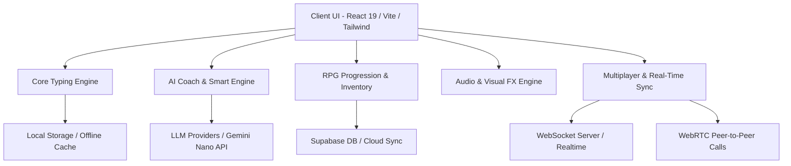

# TypeNova: Product Requirements Document (PRD)

**Version:** 2.5.0  
**Status:** Approved & Living Document  
**Target Release:** Production (Web & PWA)  
**Author:** DeepMind / TypeNova Core Architecture Team  
**Repository:** `https://github.com/amimitaghosh99-alt/typenova-live`

---

## 1. Executive Summary & Vision

**TypeNova** is a high-performance, next-generation gamified typing platform designed for competitive speed typists, software engineers, and gamers. Combining sub-millisecond mechanical input processing, deep RPG progression systems, real-time multiplayer racing, WebRTC peer communications, and an offline-first AI coaching engine, TypeNova transforms touch typing from mundane practice into a competitive cybernetic sport.

### 1.1 Core Value Propositions
* **Zero-Latency Precision:** Built with custom input handlers and caret projection that eliminate DOM reflows and guarantee 120+ FPS fluid responsiveness.
* **Bring-Your-Own-Key (BYOK) AI Intelligence:** Autonomous coaching via **Aru**, powered by cloud LLMs (Groq, OpenAI, Anthropic, Gemini, DeepSeek, OpenRouter) or local zero-latency on-device models (Chrome Gemini Nano Prompt API).
* **Cybernetic Gamification:** RPG progression featuring level scaling, unlockable 3D **CyberHands** skins, daily quests, dynamic badges, and customizable mechanical switch acoustics.
* **Live Multiplayer & Real-Time Comms:** Global WebSocket-synchronized drag races, private lobbies, post-match telemetry replay, and integrated WebRTC P2P audio/video calls.
* **Universal Cross-Platform PWA:** Installable as a standalone desktop/mobile app with full offline support and seamless Supabase cloud synchronization.

---

## 2. Target Audience & User Personas

| Persona | Motivation | Key Features Leveraged |
| :--- | :--- | :--- |
| **The Cyber Racer (Competitor)** | Climbing global leaderboards, dominating live multiplayer lobbies, and shaving milliseconds off personal records. | Realtime Multiplayer, ELO Ranking, Burst Speed Metrics, Post-Match Replay Scrubber. |
| **The Software Engineer** | Mastering syntax typing across JavaScript, Python, Rust, Go, C++, and terminal commands without muscle fatigue. | Code Mode (15+ Languages), Weakness Targeting, Error Matrix Analysis, Custom Keybinds. |
| **The RPG Completionist** | Collecting rare hand skins, unlocking neon cosmetics, completing daily bounties, and leveling up CyberHands. | RPG Academy, CyberHands Cosmetics, Quests System, XP Tiering. |
| **The Casual Learner** | Improving touch-typing accuracy and speed in a gamified, beautiful, distraction-free environment. | AI Coach (Aru), Micro-Drill Generation, Virtual Keyboard Assist, Mechanical Switch Sound FX. |

---

## 3. System Architecture & Tech Stack

### 3.1 Technology Stack
* **Frontend Framework:** React 19, Vite 7, TypeScript 5.8
* **Styling & Design System:** Tailwind CSS v3.4, Radix UI Primitives, Lucide Icons, Tabler Icons
* **Graphics & Animation:** Three.js (Kinetic Keyboard & Shaders), WebGL Fluid Simulation (`SplashCursor`), Canvas 2D, Framer Motion, `@react-spring/web`
* **Audio Engine:** Web Audio API with synthesized and multi-sampled mechanical switch profiles (Cherry MX Blue/Red/Brown, Topre, Typewriter, Cyber Laser)
* **Backend & Persistence:** Supabase (Auth, Postgres, Row-Level Security, Realtime Subscriptions), LocalStorage Offline-First Engine
* **Real-Time Communications:** WebSockets (Multiplayer Sync) + WebRTC (P2P Video/Audio calling)
* **PWA & Build:** `vite-plugin-pwa`, Workbox service worker caching, standalone Web App Manifest

---

## 4. Feature Specifications & Requirements

### 4.1 High-Frequency Typing Engine
* **FR-1.1 Game Modes:**
  * **Time Mode:** 15s, 30s, 60s, 120s tests.
  * **Word Mode:** 10, 25, 50, 100 word sets.
  * **Quote Mode:** Short, Medium, Long, and All literary/cyberpunk quotes.
  * **Code Mode:** Real-world programming snippets across JavaScript, TypeScript, Python, Rust, Go, C++, HTML/CSS, SQL, Bash.
  * **Custom / Micro-Drill Mode:** User-inputted or AI-generated targeted drill text.
* **FR-1.2 Caret & Feedback:**
  * Sub-millisecond smooth gliding caret with customizable styles (Line, Block, Underline, Laser Glow).
  * Real-time character state: Pending, Correct, Incorrect, Corrected, Extra characters.
  * Live HUD metrics: WPM, Raw WPM, Accuracy (%), Error Count, Consistency (%), Realtime Chart.
* **FR-1.3 Modifier & Training Modes:**
  * **Blind Mode:** Hides user input / typed errors to train pure muscle memory.
  * **Mirrored Mode:** Horizontally flipped typing environment for cognitive training.
  * **Fog Mode:** Dense procedural fog hiding future words until the current word is cleared.
  * **Sticky Keys / Overclocked Mode:** Hyper-speed feedback penalty mechanics for advanced typists.

---

### 4.2 RPG CyberHands & Academy Progression
* **FR-2.1 Leveling & XP Economy:**
  * Formula-based XP awarding calculated from `(WPM * Accuracy) + (Streak Bonus) + (Mode Multiplier)`.
  * Tiered rank system: Novice, Hacker, NetRunner, CyberGhost, Singularity God.
* **FR-2.2 CyberHands Visualizer:**
  * Interactive 3D SVG robotic hands overlay matching real-time keystrokes to individual finger placement.
  * Unlockable hand textures and materials: Default Steel, Neon Cyan, Obsidian Matte, Gold Foil, Holographic Prism.
* **FR-2.3 Daily Quests & Achievements:**
  * Daily rotating bounties (e.g. *"Hit 100+ WPM in 60s"*, *"Type 500 characters with 98%+ accuracy"*).
  * Dynamic trophy and badge showcases displayed on public profile cards.

---

### 4.3 AI Smart Engine & Support Technician (Aru)
* **FR-3.1 Hybrid Multi-Provider Architecture (BYOK):**
  * Supports custom user API keys for **Groq**, **OpenAI**, **Anthropic**, **Google Gemini**, **DeepSeek**, and **OpenRouter**.
  * Zero-setup fallback to Chrome Built-in **Gemini Nano** Prompt API (`window.ai`) for 100% private, offline, zero-latency local intelligence.
* **FR-3.2 Diagnostic Analysis & Micro-Drills:**
  * Real-time heat mapping identifying sluggish bigrams (e.g. `th`, `str`, `ing`) and mistyped finger transitions.
  * One-click AI drill generation synthesizing customized practice texts specifically curing the user's weaknesses.
* **FR-3.3 Live Assistant UI:**
  * Slide-out drawer with GLSL volumetric laser shaders (`LaserFlow`), real-time Markdown chat, token consumption counters, and an in-app **Support Technician** assistant that auto-validates API keys upon pasting.

---

### 4.4 Multiplayer Arena & Matchmaking
* **FR-4.1 Real-Time Matchmaking:**
  * Public matchmaking queues and private password-protected race rooms.
  * Ultra-fast WebSocket state synchronization with delta compression.
* **FR-4.2 Live Race HUD & Ghost Avatars:**
  * Dynamic visual race tracks showing competitor progress, real-time WPM speeds, and lead transitions.
* **FR-4.3 Post-Match Telemetry & Scrubber:**
  * Complete race replay modal with interactive timeline scrubbing, per-second speed curves, and error heatmaps.
  * In-lobby match chat with quick cyber-emotes.

---

### 4.5 WebRTC Real-Time Comms
* **FR-5.1 P2P Video & Audio Calling:**
  * Peer-to-peer WebRTC video/audio calls during multiplayer races or 1v1 practice.
  * Movable, draggable picture-in-picture window overlay with mute, camera toggle, and fullscreen controls.
  * Zero-backend media relay (direct peer streaming).

---

### 4.6 Visual Aesthetics, Audio & Immersion
* **FR-6.1 Cyberpunk & Minimalist Themes:**
  * 15+ curated themes including `Starfield`, `Cyberpunk 2077`, `Matrix CRT`, `Dracula`, `Nord`, `Obsidian`, `Synthwave`, `Vaporwave`.
  * Full theme transition smoothing with zero flash of unstyled content.
* **FR-6.2 3D Kinetic Mechanical Keyboard:**
  * Full 100% mechanical keyboard rendered in Three.js on the landing/login view.
  * Real-time physical key depression and blinding emissive bloom lighting reacting to keystrokes.
* **FR-6.3 WebGL Fluid Simulation (`SplashCursor`):**
  * GPU-accelerated interactive fluid simulation reacting to mouse velocity with automatic memory cleanup on unmount.
* **FR-6.4 Mechanical Sound Profiles:**
  * Web Audio API synthesized switch profiles with independent volume sliders and low-latency buffer playback.

---

### 4.7 Progressive Web App (PWA) & Offline-First Operation
* **FR-7.1 App Installation:**
  * Standalone install support for Windows, macOS, Linux, iOS, and Android.
  * Custom in-app install trigger banners and URL bar prompts.
* **FR-7.2 Offline Cache Strategy:**
  * Pre-cached application shell, fonts, sound effects, quotes library, and code exercises via Workbox.
  * Seamless queueing and sync of offline session scores to Supabase upon internet reconnection.

---

## 5. Non-Functional Requirements (NFRs)

### 5.1 Performance & Latency
* **Keystroke Processing Latency:** $\le 2\text{ms}$ between hardware keydown event and visual DOM state update.
* **Target Frame Rate:** Stable **120+ FPS** during active typing sessions, avoiding layout recalculation (`forced reflow`) and memory leaks.
* **Cold App Launch:** First Contentful Paint (FCP) under $1.2\text{s}$ on standard broadband connections.

### 5.2 Security & Data Privacy
* **BYOK Key Storage:** Stored strictly on the client's `localStorage` and never transmitted to intermediary servers.
* **Database Access:** Supabase Row-Level Security (RLS) enforcing strict tenant isolation for profiles, match histories, and friend lists.
* **Input Sanitization:** XSS protection across chat rooms, user bios, and custom test inputs.

### 5.3 Reliability & Offline Resilience
* **Offline Fallback:** Complete typing drills, sound synthesis, and local stats logging must function with zero network connectivity.
* **Graceful Degradation:** Automatic WebGL capability detection with smooth fallback to CSS transforms on lower-end devices.

---

## 6. Success Metrics & KPIs

| Metric | Target | Tracking Method |
| :--- | :--- | :--- |
| **Typing Latency** | $< 2\text{ms}$ average | Chrome Performance DevTools & `performance.now()` telemetry |
| **Session FPS** | $\ge 120\text{ FPS}$ | WebGL rAF frame delta monitoring |
| **PWA Install Conversion** | $\ge 25\%$ of recurring users | `appinstalled` analytics event |
| **AI Drill Engagement** | $\ge 40\%$ of users generating micro-drills weekly | Database feature telemetry |
| **Multiplayer Sync Delta** | $< 50\text{ms}$ drift | WebSocket ping-pong timestamps |

---

## 7. Release Roadmap

### Phase 1: Core Precision & Performance (Current - v2.5.0)
* [x] Next-Gen Kinetic 3D Keyboard background.
* [x] Starfield and canvas animation stability (0 jitter on keystrokes).
* [x] Full PWA support with auto-updating Service Worker.
* [x] BYOK AI Client supporting cloud providers + Chrome Gemini Nano.
* [x] Dynamic RPG CyberHands & Leveling System.

### Phase 2: Tournament & Esports Arena (v2.6.0)
* [ ] Ranked Competitive Seasons with seasonal badge rewards.
* [ ] Bracket Tournament Engine for 16-player knockout tournaments.
* [ ] Advanced spectator mode with multi-stream WebRTC feeds.

### Phase 3: Developer Ecosystem & Customization (v2.7.0)
* [ ] Custom theme builder with GLSL shader support.
* [ ] Community drill marketplace for sharing coding flashcards and literature.
* [ ] Native Desktop distributions via Tauri v2 (`.exe`, `.dmg`, `.deb`).

---

*TypeNova PRD — Engineered for speed.*
