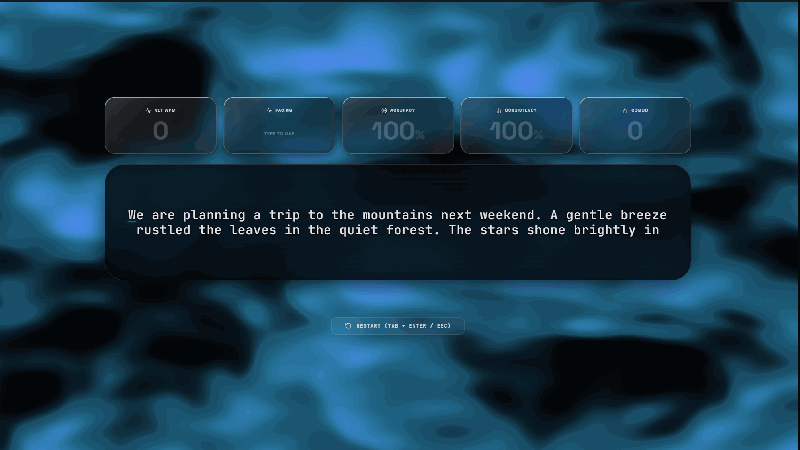
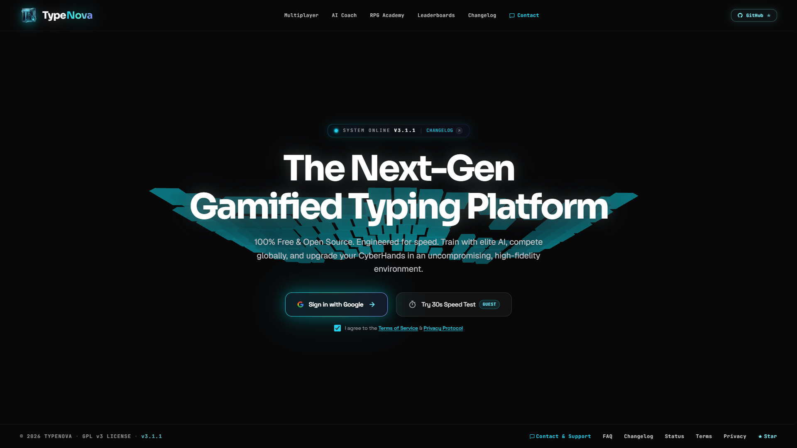
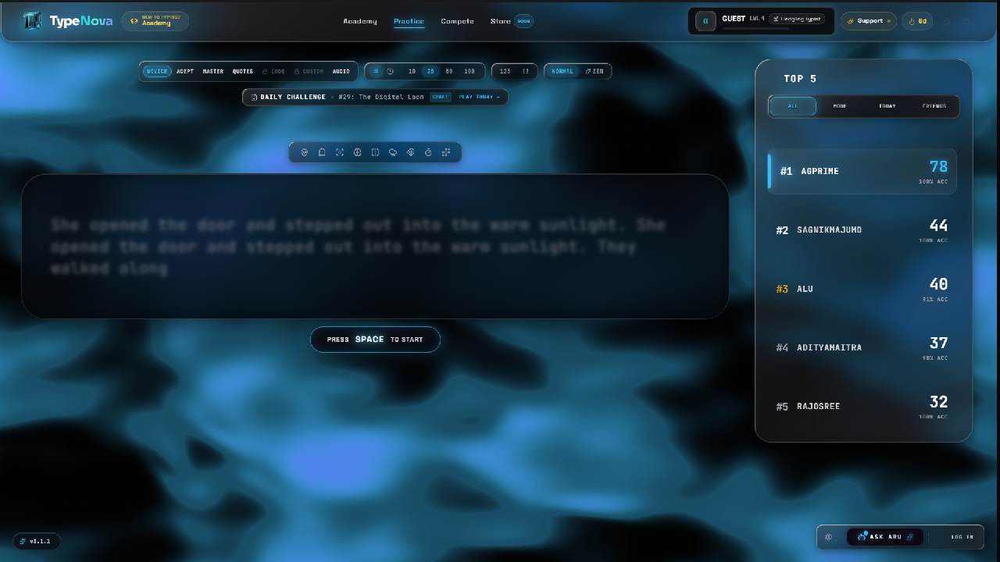
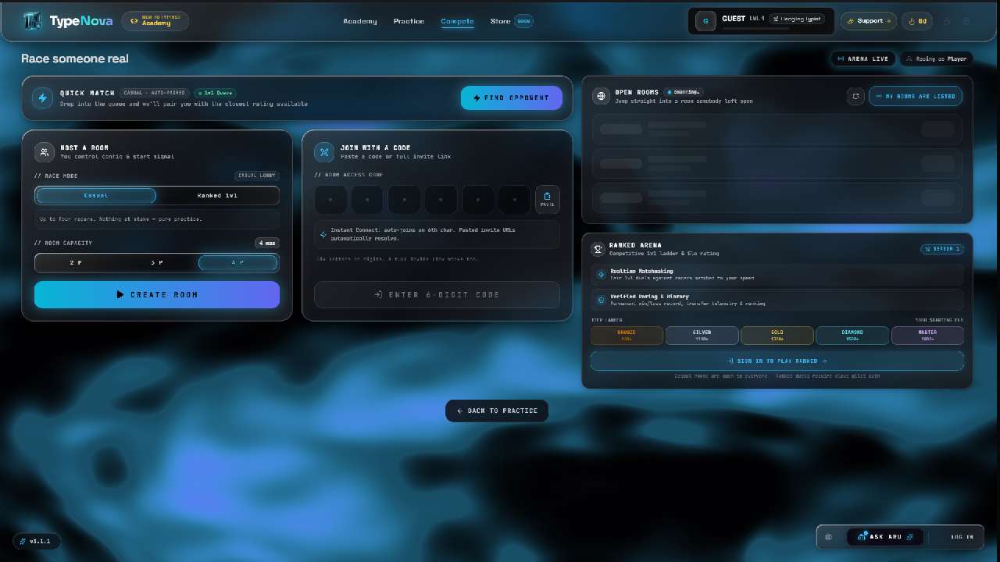
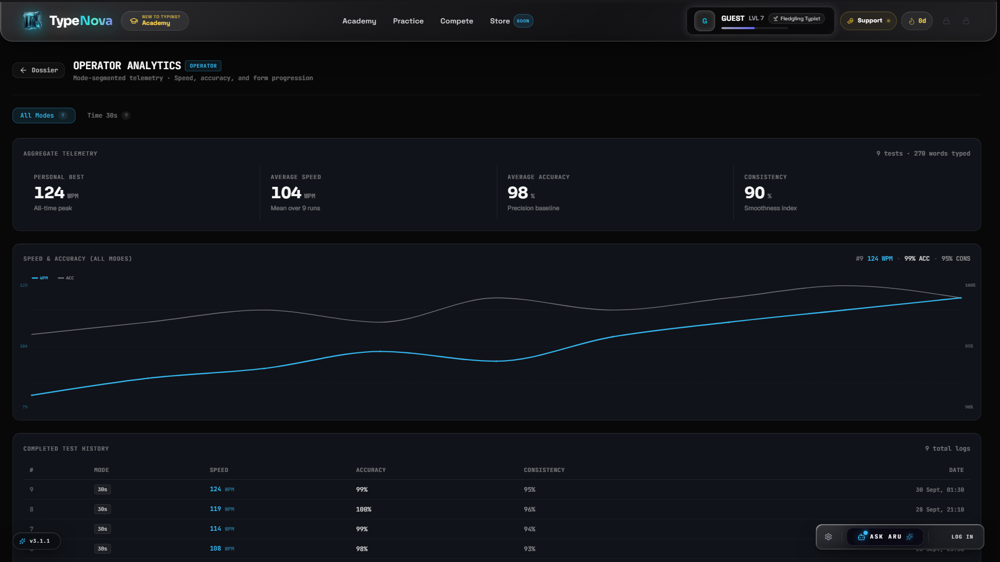
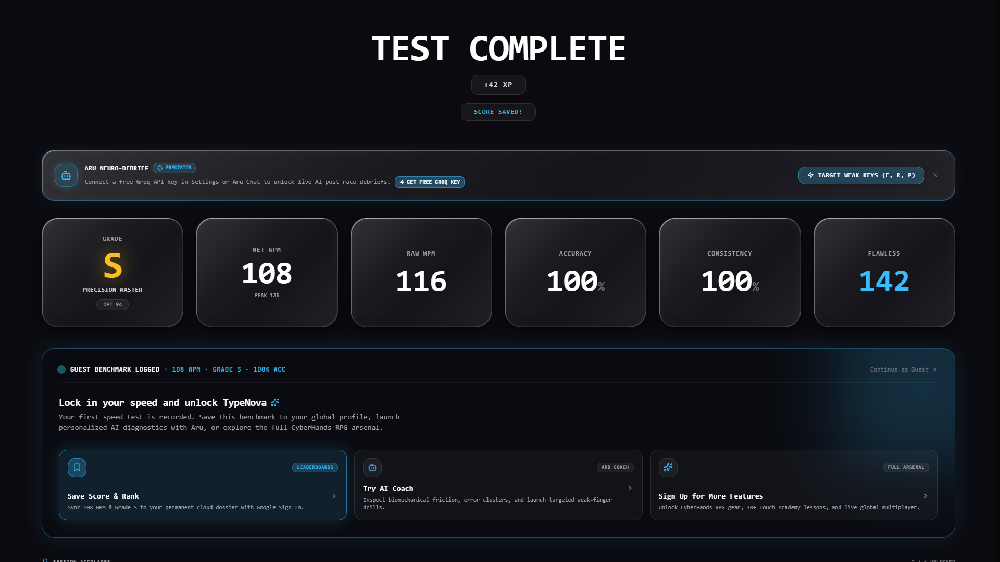

<div align="center">

# ⚡ TypeNova

### *The Next-Gen Cybernetic Gamified Typing Platform*

[](https://github.com/amimitaghosh99-alt/typenova-live/releases/tag/v3.1.1)
[](https://github.com/amimitaghosh99-alt/typenova-live/actions/workflows/ci.yml)
[](https://www.gnu.org/licenses/gpl-3.0)
[](https://react.dev/)
[](https://www.typescriptlang.org/)
[](https://web.dev/progressive-web-apps/)
[](CONTRIBUTING.md)

[**Explore Live Demo**](https://typenova-live.vercel.app) • [**Read the PRD**](docs/PRD.md) • [**Architecture Specs**](docs/ARCHITECTURE.md) • [**Roadmap**](docs/ROADMAP.md)

</div>

---

## 🌌 Overview

**TypeNova** is an open-source, ultra-low latency gamified typing platform engineered for competitive speed typists, software engineers, and gamers. 

Combining **< 2ms mechanical input processing**, **3D CyberHands RPG progression**, **real-time multiplayer racing**, and an **autonomous AI Coach (Aru)**, TypeNova transforms daily touch-typing practice into an adrenaline-fueled cybernetic sport.

<div align="center">
  
  <p><sub>⚡ <em>Real-time mechanical typing engine with smooth gliding caret, live WPM/accuracy telemetry, and mechanical audio switch synthesis.</em></sub></p>
</div>

---

## 📸 Interface Showcase

| 🎮 3D Kinetic Keyboard Landing | ⚡ Minimalist Typing Arena |
| :---: | :---: |
| [](docs/assets/screenshot-3d-keyboard.png) | [](docs/assets/screenshot-typing-arena.png) |
| *Interactive Three.js mechanical keyboard with reactive lighting & acoustics* | *Minimalist typing arena with fluid shader backdrop & live Top-5 leaderboard* |

| 🏁 Multiplayer Race Arena | 📊 Operator Telemetry & Analytics |
| :---: | :---: |
| [](docs/assets/screenshot-multiplayer.png) | [](docs/assets/screenshot-analytics.png) |
| *Real-time WebSocket matchmaking, 6-digit OTP rooms & live lobby comms* | *Dual-axis WPM/accuracy trajectory curves & diagnostic logs* |

<details>
<summary>🔍 <strong>View Post-Test Telemetry & AI Coach Debrief Screen</strong></summary>

<br />

[](docs/assets/screenshot-results.png)
*Comprehensive Grade S diagnostic summary with burst consistency scoring and AI Coach Aru neuro-debrief.*

</details>

---

## 🚀 Key Features

### ⚡ 1. High-Frequency Mechanical Typing Engine
* **< 2ms Input Processing:** Zero layout thrashing and reflow-free caret tracking targeting a solid **120+ FPS**.
* **Comprehensive Game Modes:**
  * **Time Trials:** 15s, 30s, 60s, 120s high-intensity sprints.
  * **Word Sets:** 10, 25, 50, 100 benchmark batches.
  * **Code Mode:** Real-world programming syntax across 15+ languages (*JavaScript, TypeScript, Python, Rust, Go, C++, HTML/CSS, SQL, Bash*).
  * **Quotes:** Literary, philosophical, and cyberpunk lore quotes.
* **Cognitive Training Modifiers:**
  * **Blind Mode:** Hides input errors to enforce pure muscle memory.
  * **Mirrored Mode:** Flipped layout challenging spatial cognition.
  * **Fog Mode:** Procedural mist that hides upcoming words until current targets are cleared.

---

### 🤖 2. Smart AI Coach (Aru) & BYOK Intelligence
* **Bring Your Own Key (BYOK):** Seamless multi-provider support for **Groq**, **OpenAI**, **Anthropic (Claude)**, **Google Gemini**, **DeepSeek**, and **OpenRouter**.
* **Zero-Latency Local AI:** Automatic integration with Chrome's built-in **Gemini Nano** Prompt API (`window.ai`) for 100% private on-device intelligence with 0 API keys required.
* **Dynamic Weakness Diagnostics:** Real-time analysis of slow bigrams (e.g. `th`, `str`, `ing`) and instantaneous generation of targeted micro-drills to fix specific finger weaknesses.
* **Support Technician Bot:** In-app diagnostics that automatically tests, validates, and slots API keys upon pasting into the terminal.

---

### 🎮 3. RPG Academy & CyberHands Progression
* **Formulaic XP & Tier Ranks:** Earn XP based on `(WPM × Accuracy) + Streak Bonus` and climb from *Novice* to *NetRunner* and *Singularity God*.
* **Interactive 3D CyberHands:** Real-time visual overlay mirroring physical finger placement with unlockable skins (*Neon Cyan, Obsidian, Gold Foil, Holographic Prism*).
* **Daily Bounties & Trophy Showcase:** Rotating daily quests with achievement badges displayed on public player profile cards.

---

### 🏁 4. Real-Time Multiplayer Racing & Comms
* **Serverless Multiplayer via Supabase Realtime:** Low-latency multiplayer drag races running 100% client-side on Vercel Edge without requiring persistent custom Node.js/Socket.io backend servers.
* **Presence Channels (`RealtimeChannel.track()`):** Synchronizes live player slots, ready states, peer latency pings, and typing progress (throttled at 200ms intervals to prevent socket flooding).
* **Broadcast Channels (`RealtimeChannel.send()`):** Ephemeral dispatch of synchronized countdown starts with host clock compensation, tactical sabotage hex attacks, in-lobby text chat, and post-match speed curves.
* **Host Migration & Resilience:** Client-side host election ensures seamless match continuity if the room creator disconnects, backed by exponential-backoff socket reconnection.
* **Direct Communications (`CommsModal`):** Direct player-to-player messaging and friends roster powered by Supabase Realtime Postgres Changes.

---

### 🎨 5. Cybernetic Aesthetics & Audio FX
* **Kinetic 3D Mechanical Keyboard:** Full 100% mechanical keyboard rendered in Three.js on landing views, featuring reactive physical key depression and emissive bloom.
* **GLSL Cosmic Liquid Shader (`CosmicLiquidShader`):** GPU-accelerated procedural simplex noise and liquid wave shader responding dynamically to mouse coordinates and active theme palette.
* **Acoustic Switch Synthesis:** Web Audio API procedural sound profiles (*Thocky Holy Panda, Linear Cherry Red, Tactile Clicky, Buckling Spring Model M, Alpaca Linear, Arcade 8-bit, Raindrops*).
* **15+ Themes:** Starfield, Matrix CRT, Cyberpunk, Dracula, Nord, Obsidian, Synthwave, Vaporwave, and more.

---

### 📱 6. Progressive Web App (PWA)
* **Install Anywhere:** Native windowed app experience on Windows, macOS, Linux, iOS, and Android.
* **Offline-First:** Service worker pre-caching ensures typing tests, quotes, code drills, and audio synthesizers run seamlessly without internet connectivity.

---

## 🛠️ Tech Stack

| Category | Technology |
| :--- | :--- |
| **Core Frontend** | [React 19](https://react.dev/), [TypeScript 5.8](https://www.typescriptlang.org/), [Vite 7](https://vite.dev/) |
| **Styling & UI** | [Tailwind CSS v3.4](https://tailwindcss.com/), [Radix UI](https://www.radix-ui.com/), [Lucide Icons](https://lucide.dev/) |
| **3D & Visuals** | [Three.js](https://threejs.org/), Custom GLSL Shaders (`CosmicLiquidShader`), [Framer Motion](https://www.framer.com/motion/) |
| **Audio Engine** | Web Audio API Low-Latency Synthesizer |
| **Backend & Cloud** | [Supabase](https://supabase.com/) (Auth, PostgreSQL, Row-Level Security, Edge Functions) |
| **Realtime & Multiplayer** | [Supabase Realtime](https://supabase.com/docs/guides/realtime) (WebSockets — Presence Channels, Broadcast Events & Postgres Changes) |
| **PWA & Offline** | `vite-plugin-pwa`, Workbox Pre-caching |

---

## ⚡ Quickstart & Local Development

### Prerequisites
* **Node.js** 20.x or higher
* **npm** or **pnpm** / **yarn**

### 1. Clone the Repository
```bash
git clone https://github.com/amimitaghosh99-alt/typenova-live.git
cd typenova-live
```

### 2. Install Dependencies
```bash
npm install
```

### 3. Configure Supabase & Environment Variables
TypeNova uses Supabase for user authentication, cloud progress synchronization, and real-time multiplayer racing.

1. **Create Environment File:**
   ```bash
   cp .env.example .env
   ```
2. **Add Your Supabase API Keys:**
   ```env
   VITE_SUPABASE_URL=https://your-project.supabase.co
   VITE_SUPABASE_ANON_KEY=your-anon-key
   ```
3. **Apply Database Migrations:**
   TypeNova includes 20 idempotent database migrations in [`supabase/migrations/`](supabase/migrations/) covering user profiles, leaderboards, anticheat verification, Elo ratings, and direct messaging.
   
   - **Via Supabase CLI (Local Development):**
     ```bash
     npx supabase start
     npx supabase db reset
     ```
   - **Via Supabase Web Dashboard (Hosted Cloud):**
     Open **Supabase Dashboard → SQL Editor**, and execute the migration files sequentially from [`supabase/migrations/`](supabase/migrations/) (starting with `20260721000000_auth_profiles.sql`).

4. **Configure Authentication & Google OAuth:**
   Follow our step-by-step [**Supabase Auth & Cloud Sync Guide**](docs/AUTH_SETUP.md) to enable Google OAuth, configure authorized redirect URLs (`http://localhost:3000` for development and your production domain), and enable seamless cloud progress saving.

### 4. Start Development Server
```bash
npm run dev
```
Open [http://localhost:3000](http://localhost:3000) in your browser to launch TypeNova.  
*(Note: `vite.config.ts` explicitly binds the dev server to port `3000`, overriding Vite's default `5173`.)*

### 5. Build for Production
```bash
npm run build
npm run preview
```

---

## ⌨️ Global Keyboard Shortcuts

| Shortcut | Action |
| :--- | :--- |
| <kbd>Tab</kbd> or <kbd>Tab</kbd> + <kbd>Enter</kbd> | Instant Restart current typing test |
| <kbd>Ctrl</kbd> + <kbd>Backspace</kbd> | Erase entire word backward |
| <kbd>Esc</kbd> | Close open modal / dismiss dialogs |
| <kbd>Ctrl</kbd> + <kbd>Shift</kbd> + <kbd>G</kbd> | Access God Mode developer console |
| <kbd>Alt</kbd> + <kbd>1</kbd>–<kbd>4</kbd> / <kbd>F1</kbd>–<kbd>F4</kbd> | Cast Tactical Sabotage Hex abilities (Multiplayer) |

---

## 📂 Project Structure

```
typenova/
├── public/                 # PWA icons, web app manifest, static audio switch samples
├── src/
│   ├── components/         # 40+ UI components, modals, and overlays
│   │   ├── academy/        # CyberHands visualizer & virtual keyboard
│   │   ├── graphs/         # Replay telemetry & performance charts
│   │   ├── profile/        # Player dossier, IKI & Shadowing telemetry inspectors
│   │   ├── ui/             # Radix UI primitives & Starfield canvas
│   │   ├── AIChatBot.tsx   # Aru AI Assistant drawer with LaserFlow shaders
│   │   ├── CommsModal.tsx  # Real-time player communications & messaging
│   │   ├── CosmicLiquidShader.tsx # GPU procedural simplex noise & fluid wave shader
│   │   ├── KineticKeyboard.tsx # 3D Three.js reactive keyboard
│   │   └── TypingArea.tsx  # Low-latency typing input & gliding caret
│   ├── data/               # Themes, switch sound profiles, quote datasets, titles
│   ├── hooks/              # Core engines (useTypingEngine, useRace, useRPGSystem, etc.)
│   ├── lib/                # AI client, Supabase client, audio synthesizer, technician brain
│   ├── pages/              # Login, Landing, and Arena views
│   ├── tests/              # 105 automated test suites & custom E2E runner (417+ tests)
│   ├── utils/              # Helper utilities and formatting functions
│   ├── App.tsx             # Root container & HUD orchestrator
│   └── main.tsx            # Application entry & Service Worker registration
├── supabase/               # Backend database migrations & Edge Functions
│   ├── migrations/         # 20 idempotent PostgreSQL schemas, RLS policies & RPCs
│   └── functions/          # Serverless Edge Functions
├── scripts/                # Verification, benchmarking & media generation tools
├── docs/                   # Product requirements, architecture, media & roadmap
│   ├── assets/             # Visual showcase screenshots & animated typing demo GIF
│   ├── PRD.md              # Comprehensive Product Requirements Document
│   ├── ARCHITECTURE.md     # System Architecture & Technical Specifications
│   ├── ROADMAP.md          # Public feature and release horizons roadmap
│   └── AUTH_SETUP.md       # Supabase OAuth & cloud sync setup guide
├── vite.config.ts          # Vite configuration, port 3000 override & VitePWA manifest
├── CONTRIBUTING.md         # Developer contribution guidelines
├── CODE_OF_CONDUCT.md      # Contributor code of conduct
├── SECURITY.md             # Security policy & vulnerability reporting
├── CHANGELOG.md            # Release changelog & version history
└── LICENSE                 # GNU General Public License v3.0 (GPLv3)
```

---

## 🤝 Contributing

We welcome contributions from developers, designers, and typing enthusiasts!  
Check out our [**Contributing Guide**](CONTRIBUTING.md) to get started with pull requests, issue reporting, and style guidelines.

---

## 📄 License

TypeNova is 100% Free and Open Source software licensed under the **[GNU General Public License v3.0 or later (GPL-3.0-or-later)](LICENSE)**.

Anyone is free to run, study, modify, and redistribute this software. In accordance with the GPLv3 copyleft terms, any derivative works or software incorporating TypeNova code must also be licensed under the GPLv3 and have their source code made publicly available.

---

<div align="center">

**Built with precision for the global typing community.**  
⭐ *If you love TypeNova, give us a star on [GitHub](https://github.com/amimitaghosh99-alt/typenova-live)!*

</div>
