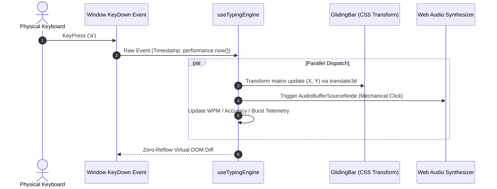
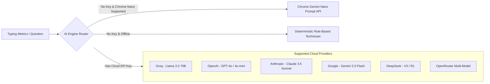
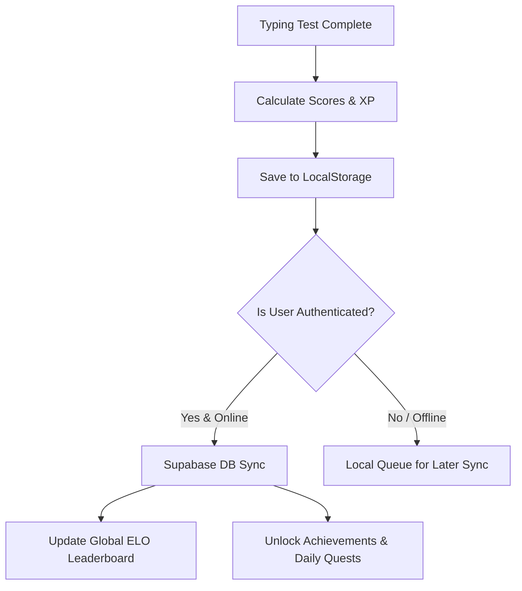

# TypeNova: System Architecture & Technical Specifications

**Version:** 2.5.0  
**Target Systems:** Modern Evergreen Browsers, PWA Standalone (Desktop & Mobile)  
**Primary Language:** TypeScript / React 19 / Vite

---

## 1. Architectural Philosophy

TypeNova is engineered around three non-negotiable principles:
1. **< 2ms Input Processing Latency:** Zero forced synchronous layout reflows on typing keystrokes, targeting $< 2\text{ms}$ average keystroke dispatch.
2. **120+ FPS Visual Immersion:** Strict memoization boundaries, GPU shader resource recycling, and pausable render loops.
3. **Offline-First Resilience with BYOK Privacy:** Complete core functionality without internet access, with sensitive user API keys kept strictly on the client.

```mermaid
flowchart TB
    subgraph UI_Layer [Presentation & Interaction Layer]
        MainApp[App.tsx Orchestrator]
        TypingView[TypingArea.tsx & GlidingBar]
        CyberHands[CyberHands.tsx 3D SVG Overlay]
        AruChat[AIChatBot.tsx & LaserFlow Shader]
        MultiplayerHUD[CompeteEntryScreen & RaceTrack]
        LiquidShader[CosmicLiquidShader.tsx WebGL Canvas]
    end

    subgraph State_Engine [Core State & Logic Engines]
        useTypingEngine[useTypingEngine Hook]
        useRPGSystem[useRPGSystem Hook]
        useSmartEngine[useSmartEngineConfig & aiClient]
        useRace[useRace & Realtime Syncer]
        useAudioEngine[Web Audio Synthesizer]
    end

    subgraph Persistence_Cloud [Data & Cloud Integration]
        LocalStorage[Client LocalStorage Engine]
        WorkboxSW[Workbox Service Worker Precache]
        SupabaseAuth[Supabase Auth & RLS Postgres]
        SupabaseRealtime[Supabase Realtime WebSockets]
        LLMProviders[Cloud LLMs & Chrome Gemini Nano]
    end

    MainApp --> useTypingEngine
    MainApp --> useRPGSystem
    MainApp --> useSmartEngine
    MainApp --> useRace
    MainApp --> useAudioEngine

    useTypingEngine --> TypingView
    useRPGSystem --> CyberHands
    useSmartEngine --> AruChat
    useRace --> MultiplayerHUD
    MainApp --> LiquidShader

    useTypingEngine --> LocalStorage
    useRPGSystem --> SupabaseAuth
    useRace --> SupabaseRealtime
    useSmartEngine --> LLMProviders
    WorkboxSW --> UI_Layer
```

---

## 2. Low-Latency Typing Pipeline

### 2.1 Reflow-Free Caret Projection
Standard typing applications often calculate the caret's bounding box using `element.getBoundingClientRect()` or deep `offsetParent` loops on every keystroke. In TypeNova, this is eliminated:
* **Pre-computed Character Metrics:** Line wrapping and character offset positions are precalculated during test initialization.
* **Hardware-Accelerated Caret Translation:** The `GlidingBar` uses pure CSS `transform: translate3d(x, y, 0)` with hardware compositing (`will-change: transform`), completely bypassing the browser's layout recalculation phase.
* **Result:** Processing time per keypress is $< 2\text{ms}$ on average.

---

## 3. Visual & WebGL Lifecycle Management

### 3.1 Three.js Kinetic Mechanical Keyboard
* **Structure:** A fully modeled 100% mechanical keyboard rendered in Three.js on landing screens.
* **Emissive Reactive Lighting:** An in-memory `Map<string, KeyData[]>` maps physical `event.code` keys to 3D meshes. When a user presses a key, the mesh Y-axis depresses by `0.5` units and its material `emissiveIntensity` spikes to `3.0` (pure white bloom) before smoothly interpolating back via exponential decay.
* **Edge Masking:** Uses CSS `maskImage: linear-gradient` to blend canvas boundaries into the `#080809` background without clipping.

### 3.2 CosmicLiquidShader (GPU Procedural Liquid Shader)
* **Custom GLSL Canvas:** Located at `src/components/CosmicLiquidShader.tsx`, this component generates high-framerate procedural simplex noise and fluid wave distortions reacting in real time to mouse coordinates and theme palette variables (`u_colorA`, `u_colorB`, `u_colorC`).
* **Lifecycle Cleanup:** Explicitly cancels `requestAnimationFrame` loops, unbinds WebGL contexts, and deletes vertex/fragment shader programs upon unmount, preventing VRAM leaks across route transitions.

### 3.3 LaserFlow (Volumetric Laser Shader in AIChatBot)
* **Pausable Render Loop:** When the AI Coach drawer is closed, `<LaserFlow paused={!isOpen} />` skips `renderer.render()`, freeing 100% of GPU compute during active typing gameplay.

---

## 4. AI Coach Architecture & BYOK Engine

TypeNova implements a **hybrid dual-layer AI routing engine**:

### 4.1 On-Device Gemini Nano Integration
* Detects Chrome's native AI API via `window.ai.languageModel`.
* When available, all weakness analysis, encouragement, and drill generation run **100% offline on the user's NPU/GPU** with zero network latency.

### 4.2 Security & Key Isolation
* API keys are stored in browser `localStorage` under `typenova_byok_api_key`.
* Keys are never proxied through TypeNova backend servers; requests are dispatched directly from the client browser to provider endpoints (`api.groq.com`, `api.openai.com`, etc.) via HTTPS CORS.

---

## 5. Real-Time Multiplayer Architecture (Supabase Realtime)

TypeNova operates without persistent custom Node.js/Socket.io backend servers. Multiplayer racing is powered 100% serverlessly through **Supabase Realtime WebSockets**:

### 5.1 Realtime Protocol Sequence
1. **Lobby Join & Presence Tracking:** Clients join a 6-character room channel (`race:<roomCode>`) and register via `channel.track()` to sync participant names, titles, ready states, and ping round-trip times.
2. **Synchronized Countdown:** The room host broadcasts `race_start` with high-precision timestamping. Clients apply local clock offset compensation (`clockOffsetRef = hostClock - localClock`) to align the countdown across distributed networks.
3. **Throttled Telemetry:** During the race, progress updates (`progress`, `wpm`, `errors`) are tracked over presence channels throttled to **200ms intervals**, eliminating WebSocket connection drops from rate limiting.
4. **Broadcast Events:** Ephemeral interactions (in-lobby chat messages, tactical sabotage hex attacks, and post-match speed curves) are dispatched via `channel.send({ type: 'broadcast', ... })`.
5. **Host Migration & Recovery:** If a room host disconnects, the client-side election algorithm automatically promotes the earliest remaining player to host without resetting racer progress.

---

## 6. Real-Time Communications & Roadmap Horizons

### 6.1 Direct Messaging & In-Lobby Comms
* **Direct Player Messaging (`CommsModal`):** Instant messaging and friends roster synchronization backed by Supabase Realtime Postgres Changes on the `direct_messages` table.
* **In-Race Text Comms:** Ephemeral lobby chat broadcast via Supabase Realtime Channels.

### 6.2 WebRTC Peer-to-Peer Calling (Roadmap Horizon)
* **Design Specification:** Future peer-to-peer audio/video streaming will utilize direct WebRTC `RTCPeerConnection` connections with public STUN servers (`stun:stun.l.google.com:19302`).
* **Relay Traversal Note:** Symmetric NAT firewalls require TURN relay fallback to guarantee connection traversal; direct P2P connections without TURN can experience failure rates up to 15–20% on strict corporate/mobile cellular networks.

---

## 7. Persistence & Cloud Synchronization

* **Offline-First:** All scores, daily quests, and local settings are instantly written to `localStorage`.
* **Sync Engine (`useCloudSync`):** On authentication or reconnection, queued offline results are batch-synced to Supabase via Postgres transactions with optimistic conflict resolution.

---

*TypeNova Architecture — Engineered for precision, speed, and scale.*
